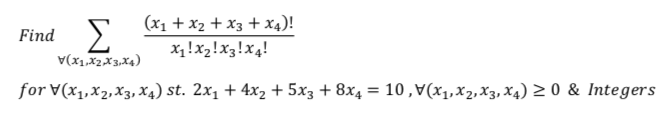
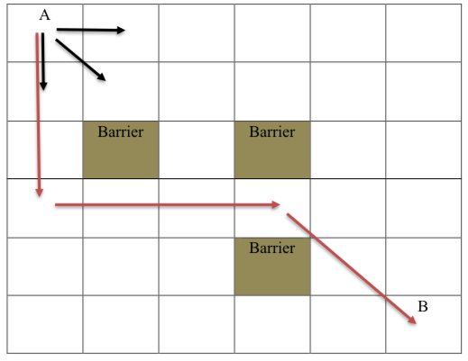
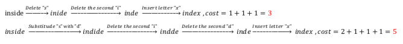
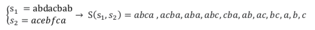

# Dynamic_Programming
Some problems in dynamic programming with Python

<h3>Problem 1</h3>

Solve the problem below using dynamic programming:

<h3>Problem 2</h3>

An agent wants to travel from point A to point B. During this trip, it can always move in three directions: down, diagonal and right.

In addition, it has no limit on the number of houses traveled in each direction. For example, mover A can move down 1 to 5 houses in the first move. Also, there are obstacles along the way that the mover should not encounter. 

With the help of dynamic programming, find the number of all virtual paths that the mobile can travel from point A to B.

<h3>Problem 3</h3>

If we search something in Google with a wrong dictation, Google corrects us by predicting the correct word. If we name the searched string 𝑆1 and the predicted string 𝑆2, our criterion should return the similarity value between the two defined strings. Then by comparing the obtained values, we can return the most appropriate string 𝑆2.

Method 1:

As the first criterion, we assume that we want to reach 𝑆1 to 𝑆2 from string 𝑆1 by using three operators: delete, insert, and replace. Among the defined parameters, delete and insert parameters will cost 1 and the replacement operator will cost 2.

For example, two ways of getting from the word "index" to "inside" is as below:

With the help of dynamic programming, find the minimum cost of getting from desired string 𝑆1 to desired string 𝑆2.

Method 2:

As the second criterion, we define a concept called subseries of a string. The subseries of the string 𝑆 is equal to any subset of its characters whose order of placement in the subseries is similar to the order of their placement in the string 𝑆. 

For example, the string "𝑎𝑐𝑎" is a sub-series of three of the main string "𝑎𝑏𝑐𝑏𝑎".

Now, the common subseries of two strings 𝑆1 and 𝑆2 is equal to the set of common characters of these two strings, which are the subseries of each of these two strings. For example, consider the following two strings:

Using dynamic programming, find the length of the largest common subseries between two arbitrary strings 𝑆1 and 𝑆2.

